# CLAUDE.md

This file provides guidance to Claude Code (claude.ai/code) when working with code in this repository.

## Project Overview

This is an ephemeral secret-sharing SaaS built with Next.js, using Convex as the backend and tRPC to proxy Convex operations. The application implements client-side 256-bit AES-GCM encryption where secrets are encrypted in the browser before being sent to the server, ensuring zero-knowledge architecture.

## Architecture

### Core Flow
1. **Homepage (`/`)**: User enters plaintext → generates AES-GCM key → encrypts locally → sends ciphertext via tRPC to Convex → receives secret ID → constructs shareable URL with key in fragment
2. **Secret viewing (`/[id]`)**: Static page → extracts key from URL fragment → fetches and deletes ciphertext from Convex via tRPC → decrypts locally → displays with reveal/copy functionality

### Key Components
- **Frontend**: Next.js 15 with App Router, React 19, Tailwind CSS 4
- **Backend**: Convex database with tRPC API layer (no direct Convex client usage)  
- **Encryption**: Client-side AES-GCM 256-bit encryption (`src/lib/crypto.ts`)
- **State Management**: React Query via tRPC, localStorage caching for creator preview
- **Routing**: SSG-enabled dynamic routes for secret pages

### Data Flow
```
Client → encrypt(plaintext) → tRPC → Convex → secretId
Recipient → tRPC → Convex → ciphertext → decrypt(key_from_fragment) → plaintext
```

## Development Commands

```bash
# Development (runs both frontend and backend)
pnpm dev

# Frontend only
pnpm dev:frontend

# Backend only (Convex)
pnpm dev:backend

# Build and type checking
pnpm build
pnpm typecheck
pnpm check  # lint + typecheck

# Linting and formatting  
pnpm lint
pnpm lint:fix
pnpm format:check
pnpm format:write
```

## Key Files and Structure

### Convex Backend
- `convex/schema.ts`: Simple secrets table with optional payload field
- `convex/myFunctions.ts`: setSecret (create) and getSecret (read-and-delete) mutations

### tRPC API Layer
- `src/server/api/routers/secrets.ts`: Proxies Convex operations, never uses direct client queries
- `src/app/api/trpc/[trpc]/route.ts`: Next.js API route handler for tRPC

### Client Components  
- `src/components/secret-form.tsx`: Main form with encryption and URL generation
- `src/components/secret-viewer.tsx`: Secret display with blur/reveal functionality
- `src/lib/crypto.ts`: All AES-GCM encryption/decryption utilities

### Pages
- `src/app/page.tsx`: Homepage with secret creation form
- `src/app/[id]/page.tsx`: Dynamic secret viewing page (SSG-enabled)

## Important Constraints

1. **No Direct Convex Client Usage**: Always use tRPC endpoints instead of Convex's useQuery/useMutation hooks
2. **Client-Side Encryption**: All encryption/decryption happens in the browser using Web Crypto API
3. **Ephemeral Secrets**: Convex mutations delete the payload immediately after reading
4. **URL Fragment Keys**: Encryption keys are stored in URL fragments (#key) for client-side access
5. **SSG Architecture**: Secret pages use generateStaticParams() for optimal performance

## Caching Strategy

### Secret Persistence Behavior
- **getSecret endpoint**: Configured with `staleTime: Infinity` and `gcTime: Infinity`
- **Cache pre-population**: When creating secrets, ciphertext is immediately cached to prevent owner from consuming their own secret
- **Cross-session persistence**: Uses `@tanstack/query-async-storage-persister` with localStorage
- **Cache key format**: TanStack Query keys + `secret_${id}` in localStorage for metadata
- **No refetching**: All refetch options disabled (`refetchOnMount`, `refetchOnWindowFocus`, etc.)

### Cache Population Points
1. **Secret creation**: Owner's cache pre-populated in `SecretForm` component
2. **First viewing**: Recipient's cache populated after server fetch in `SecretViewer`
3. **Page refresh**: Both owner and recipient load from cache, no server calls

## TanStack Query Setup

### Query Client Architecture
- **Single source**: `src/trpc/query-client.ts` serves both server and client
- **Server behavior**: Creates fresh QueryClient for each request, no persistence
- **Client behavior**: Singleton pattern with localStorage persistence via `createAsyncStoragePersister`
- **Hydration**: Shared configuration ensures proper SSR/client hydration
- **Modern patterns**: Uses `@tanstack/query-async-storage-persister` (not deprecated `createSyncStoragePersister`)

## Security Notes

- Encryption keys never leave the client browser
- Server only stores encrypted ciphertext, never plaintext
- Secrets are deleted immediately upon first access
- Base64url encoding used for URL-safe key transmission
- Local cache only stores encrypted ciphertext, never plaintext or keys

## Architecture Diagram

```mermaid
graph TB
    %% Client Side (Creator)
    C1[👤 Creator] --> |1. Enter secret| F1[🔒 AES-256-GCM<br/>Encryption<br/>in Browser]
    F1 --> |2. Generate key| K1[🔑 Encryption Key<br/>stays in browser]
    F1 --> |3. Encrypted data| API1[📡 tRPC API Call]
    
    %% Server Side
    API1 --> |4. Store ciphertext| S[🖥️ Next.js Server<br/>tRPC Router]
    S --> |5. Save to DB| DB[(🗄️ Convex Database<br/>Encrypted payload only)]
    DB --> |6. Return ID| S
    S --> |7. Secret ID| API1
    
    %% URL Generation
    API1 --> |8. Create URL| URL[📋 Shareable URL<br/>domain.com/secretId#key]
    K1 --> |Key in fragment| URL
    
    %% Local Caching (Creator)
    F1 --> |Cache encrypted| LC1[💾 Creator's<br/>Local Cache<br/>encrypted data]
    
    %% Client Side (Recipient)
    C2[👥 Recipient] --> |9. Open URL| B2[🌐 Browser extracts<br/>key from #fragment]
    B2 --> |10. Fetch request| API2[📡 tRPC API Call<br/>with secret ID]
    
    %% Server deletion
    API2 --> S2[🖥️ Server fetches<br/>& deletes from DB]
    DB --> |Read & DELETE| S2
    S2 --> |11. Return ciphertext| API2
    
    %% Client decryption
    API2 --> |12. Encrypted data| F2[🔓 AES-256-GCM<br/>Decryption<br/>in Browser]
    B2 --> |Key from URL| F2
    F2 --> |13. Decrypted secret| C2
    
    %% Local Caching (Recipient)
    F2 --> |Cache encrypted| LC2[💾 Recipient's<br/>Local Cache<br/>encrypted data]
    
    %% Subsequent access
    LC1 -.-> |Future access<br/>No server calls| C1
    LC2 -.-> |Future access<br/>No server calls| C2
    
    %% Styling
    classDef client fill:#e1f5fe,stroke:#01579b,stroke-width:2px
    classDef server fill:#f3e5f5,stroke:#4a148c,stroke-width:2px
    classDef database fill:#e8f5e8,stroke:#1b5e20,stroke-width:2px
    classDef crypto fill:#fff3e0,stroke:#e65100,stroke-width:2px
    classDef cache fill:#fce4ec,stroke:#880e4f,stroke-width:2px
    
    class C1,C2,B2 client
    class S,S2,API1,API2 server
    class DB database
    class F1,F2,K1 crypto
    class LC1,LC2 cache
```



## Detailed Process Description for Diagram Generation

### SecretShare Application - Complete Process Flow

**Application Overview:**
SecretShare is a zero-knowledge, ephemeral secret-sharing web application that enables users to securely share sensitive information through encrypted, one-time-access URLs. The application ensures that secrets are encrypted client-side before transmission and automatically deleted after first access.

**Visual Process Flow Description:**

**Phase 1: Secret Creation (Creator Side)**
1. **User Interaction**: A person (Creator) sits at their computer/device and types a secret message into a web form on the SecretShare homepage
2. **Client-Side Encryption**: The browser automatically generates a 256-bit AES-GCM encryption key and encrypts the secret locally (show encryption happening inside the browser with lock/key icons)
3. **Data Transmission**: Only the encrypted ciphertext is sent to the server via a secure HTTPS connection (show encrypted data packets traveling to server)
4. **Server Processing**: The Next.js server receives the encrypted data through tRPC API and stores it in the Convex database (server never sees plaintext)
5. **Database Storage**: The database stores only the encrypted payload with a unique secret ID (show database with locked/encrypted entries)
6. **URL Generation**: The server returns the secret ID, and the browser creates a shareable URL with the encryption key embedded in the URL fragment (#key)
7. **Local Caching**: The creator's browser caches the encrypted secret locally for preview purposes

**Phase 2: Secret Sharing**
8. **URL Sharing**: The creator copies and shares the generated URL through their preferred communication method (email, messaging, etc.)
9. **URL Structure**: Show the URL format: `https://secretshare.app/abc123#encryptionkey` where the key after # never reaches the server

**Phase 3: Secret Retrieval (Recipient Side)**
10. **URL Access**: The recipient clicks/opens the shared URL in their browser
11. **Key Extraction**: The recipient's browser automatically extracts the encryption key from the URL fragment (after the #)
12. **Server Request**: The browser makes a request to the server using only the secret ID (not the key)
13. **Server Response & Deletion**: The server fetches the encrypted data from the database and immediately deletes it (one-time access)
14. **Client-Side Decryption**: The recipient's browser uses the key from the URL to decrypt the secret locally
15. **Secret Display**: The decrypted secret is displayed to the recipient with reveal/hide functionality
16. **Local Caching**: The recipient's browser also caches the encrypted secret locally

**Phase 4: Subsequent Access**
17. **Offline Access**: Both creator and recipient can revisit the URL and access the secret from their local browser cache without any server communication
18. **Server State**: The server database no longer contains the secret data after first access

**Key Visual Elements to Include:**
- **Browser Icons**: Show distinct browsers for creator and recipient
- **Encryption Symbols**: Lock/unlock icons, key symbols, encrypted data representation
- **Server Architecture**: Next.js server, tRPC API layer, Convex database
- **Data Flow Arrows**: Clear directional arrows showing data movement
- **Security Indicators**: Shields, locks, "HTTPS" labels, "ENCRYPTED" badges
- **Cache Representations**: Local storage icons in browsers
- **Deletion Animation**: Show data being deleted from server after first access
- **URL Structure**: Visual representation of URL with fragment highlighted

**Security Emphasis Points:**
- Keys never leave the browser
- Server only sees encrypted data
- Automatic deletion after first access
- Zero-knowledge architecture
- Local caching for performance and offline access

**Color Coding Suggestions:**
- Blue: Client-side operations
- Purple: Server-side operations  
- Green: Database operations
- Orange: Encryption/decryption processes
- Pink: Local caching operations