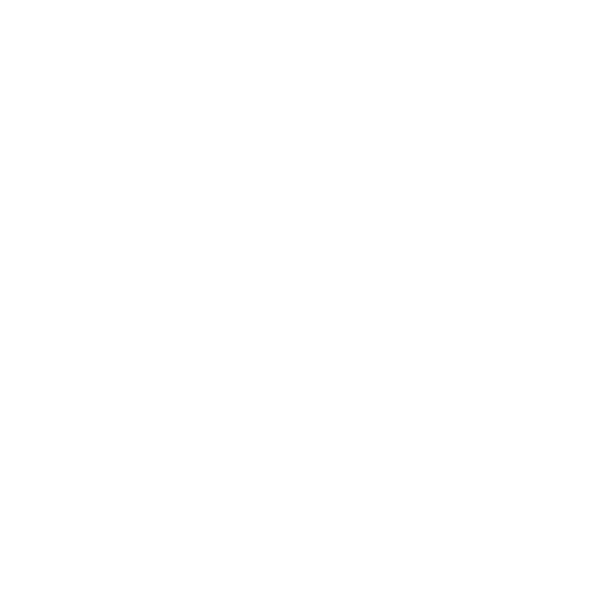

# Secret Share - Secure One-Time Secret Sharing

<div align="center">
  
  <h3>Share encrypted secrets that can only be viewed once</h3>
  <p>End-to-end client encryption • Zero-knowledge architecture • One-time access</p>
</div>

---

## 🔒 Overview

**Secret Share** is a modern, secure web application for sharing sensitive information over untrusted communication channels. It uses military-grade encryption to ensure your secrets remain private and automatically destroys them after the first access.

### ✨ Key Features

- **🛡️ End-to-End Encryption**: AES-256-GCM encryption performed entirely in your browser
- **🔑 Zero-Knowledge Architecture**: Encryption keys are stored in URL fragments, never sent to our servers
- **👁️ One-Time Access**: Secrets are permanently deleted after the first read
- **💾 Local Caching**: Both sender and receiver can access the secret locally after initial read
- **🚀 Modern Stack**: Built with Next.js 15, React 19, and TypeScript
- **🎨 Beautiful UI**: Responsive design with smooth animations and dark theme
- **🔧 Developer-Friendly**: Docker development environment with hot reloading

## 🛠️ Tech Stack

- **Frontend**: Next.js 15, React 19, TypeScript, Tailwind CSS
- **Backend**: Convex (real-time database)
- **API**: tRPC for type-safe API calls
- **Encryption**: Web Crypto API (AES-256-GCM)
- **Development**: Docker, pnpm, ESLint, Prettier
- **UI Components**: Shadcn (Radix UI, Lucide Icons, Framer Motion)

## 🔐 How It Works

1. **Client-Side Encryption**: Your secret is encrypted in your browser using AES-256-GCM
2. **Secure Transmission**: Only the encrypted ciphertext is sent to our servers
3. **URL Generation**: A unique URL is created with the encryption key in the fragment (#key)
4. **One-Time Access**: When someone first opens the URL, the secret is fetched and immediately deleted
5. **Local Caching**: Both sender and receiver can access the secret locally after the initial read
6. **Malicious Access Protection**: If the link leaks, subsequent attempts will show a 404 error

### 🔒 What We Store vs Never Store

**✅ What We Store:**

- Encrypted ciphertext only
- Unique secret identifier
- Timestamp for auto-deletion

**❌ What We Never Store:**

- Your plaintext secrets
- Encryption keys
- Personal information
- Access logs or metadata

## 🚀 Quick Start

### Prerequisites

- Docker and Docker Compose
- Make (included in most Unix systems)

### Installation

1. **Clone the repository**

   ```bash
   git clone https://github.com/PaulSenon/PROJ-9084-share-secret-saas.git
   cd PROJ-9084-share-secret-saas
   ```

2. **Set up environment**

   ```bash
   make create-env-files
   # Edit .env.local with your Convex configuration
   ```

3. **Install dependencies**

   ```bash
   make install
   ```

4. **Start development server**

   ```bash
   make dev
   ```

5. **Open your browser**
   Navigate to `http://localhost:3000`

## 📦 Available Commands

| Command              | Description                                          |
| -------------------- | ---------------------------------------------------- |
| `make install`       | Install all dependencies                             |
| `make dev`           | Start development server                             |
| `make bash`          | Access container shell                               |
| `make run cmd="..."` | Run arbitrary command in container                   |
| `make clean`         | Clean everything (containers, volumes, dependencies) |
| `make stop`          | Stop all containers                                  |
| `make help`          | Show all available commands                          |

### Package Manager Commands

| Command             | Description              |
| ------------------- | ------------------------ |
| `make pnpm-install` | Install dependencies     |
| `make pnpm-build`   | Build for production     |
| `make pnpm-start`   | Start production server  |
| `make pnpm-dev`     | Start development server |

## 🌐 Environment Configuration

Create a `.env.local` file with your Convex configuration:

```env
# LOCAL SECRETS - NEVER COMMIT
CONVEX_DEPLOYMENT=your-convex-deployment-url
NEXT_PUBLIC_CONVEX_URL=your-convex-url
PORT=3000
```

To get your Convex credentials:

1. Sign up at [Convex](https://convex.dev)
2. Create a new project
3. Run `npx convex dev` to get your deployment URL

## 🏗️ Project Structure

```
src/
├── app/                    # Next.js App Router
│   ├── [id]/              # Secret viewing page
│   ├── how-it-works/      # Documentation page
│   └── layout.tsx         # Root layout
├── components/            # React components
│   ├── ui/               # Reusable UI components
│   ├── secret-form.tsx   # Main secret creation form
│   └── secret-viewer.tsx # Secret viewing component
├── lib/
│   └── crypto.ts         # Encryption/decryption utilities
├── hooks/
│   └── use-secret.ts     # Secret management hooks
└── server/
    └── api/              # tRPC API routes

convex/                   # Convex backend
├── schema.ts            # Database schema
└── myFunctions.ts       # Backend functions

docker/                  # Development environment
└── dev/
    ├── docker-compose.yml
    └── Dockerfile.devEnv
```

## 🔧 Development

### Docker Development Environment

This project uses Docker for consistent development across all platforms. The development environment includes:

- Node.js 22
- pnpm package manager
- Git, make, nano, curl
- Claude Code CLI
- Automatic dependency installation

### Code Quality

- **TypeScript**: Full type safety
- **ESLint**: Code linting with Next.js rules
- **Prettier**: Code formatting
- **Tailwind CSS**: Utility-first styling

### Development Workflow

1. **Start development**: `make dev`
2. **Access container**: `make bash`
3. **Run commands**: `make run cmd="your-command"`
4. **Check code**: `make run cmd="pnpm check"`
5. **Format code**: `make run cmd="pnpm format:write"`

## 🚢 Deployment

### Production Build

```bash
make pnpm-build
make pnpm-start
```

### Deployment Options

The application can be deployed on:

- **Vercel** (recommended for Next.js)
- **Netlify**
- **Docker** (using production Dockerfile)
- Any platform supporting Node.js

## 🤝 Contributing

We welcome contributions! Please follow these steps:

### Getting Started

1. **Fork the repository**
2. **Clone your fork**

   ```bash
   git clone https://github.com/your-username/PROJ-9084-share-secret-saas.git
   ```

3. **Set up development environment**

   ```bash
   make clean-install
   ```

### Development Guidelines

1. **Create a feature branch**

   ```bash
   git checkout -b feature/your-feature-name
   ```

2. **Make your changes**
   - Follow existing code patterns
   - Add TypeScript types for new code
   - Update tests if applicable
   - Ensure UI components are responsive

3. **Test your changes**

   ```bash
   make run cmd="pnpm check"          # Type checking
   make run cmd="pnpm lint"           # Linting
   make run cmd="pnpm format:check"   # Format checking
   ```

4. **Commit and push**

   ```bash
   git add .
   git commit -m "feat: add your feature description"
   git push origin feature/your-feature-name
   ```

5. **Create a Pull Request**

### Code Style

- Use TypeScript for all new code
- Follow the existing component patterns
- Use Tailwind CSS for styling
- Add proper JSDoc comments for functions
- Keep components small and focused

### Areas for Contribution

- 🎨 UI/UX improvements
- 🔒 Security enhancements
- 📱 Mobile responsiveness
- 🌐 Internationalization (i18n)
- 📊 Analytics and monitoring
- 🧪 Testing coverage
- 📚 Documentation improvements

## 🔒 Security

### Reporting Security Issues

If you discover a security vulnerability, please:

1. **DO NOT** open a public issue
2. Email me (email in my profile)
3. Include detailed steps to reproduce the issue

### Security Features

- End-to-end encryption using Web Crypto API
- Zero-knowledge architecture
- Automatic secret deletion
- No server-side logging of sensitive data
- HTTPS-only in production
- Content Security Policy headers

## 📄 License

This project is licensed under the MIT License - see the [LICENSE](LICENSE) file for details.

## 🙏 Acknowledgments

- [T3 Stack](https://create.t3.gg/) for the project foundation
- [Convex](https://convex.dev) for the real-time backend
- [Vercel](https://vercel.com) for hosting platform
- [Shadcn](https://ui.shadcn.com) for accessible components

---

<div align="center">
  <p>Made with ❤️ for secure communication</p>
  <p>
    <a href="https://github.com/PaulSenon/PROJ-9084-share-secret-saas">⭐ Star this project</a> •
    <a href="https://github.com/PaulSenon/PROJ-9084-share-secret-saas/issues">🐛 Report Bug</a> •
    <a href="https://github.com/PaulSenon/PROJ-9084-share-secret-saas/issues">✨ Request Feature</a>
  </p>
</div>
